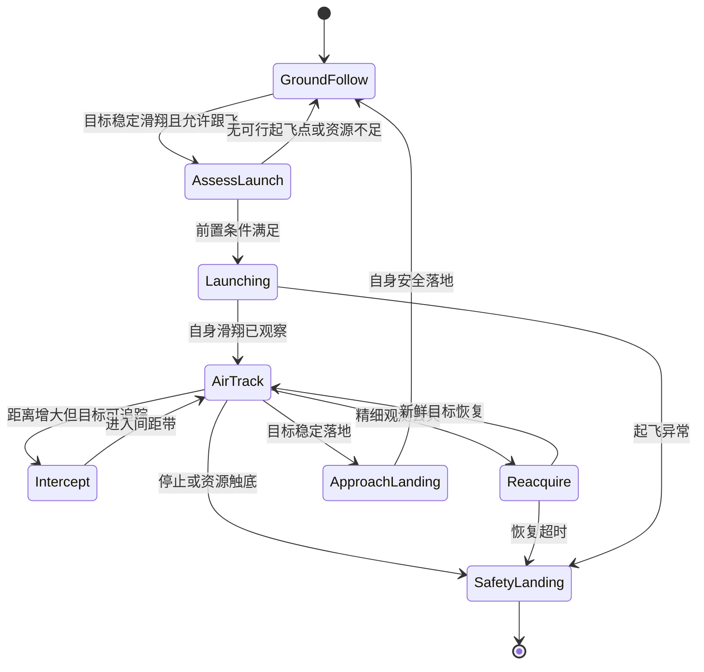

# 空中跟随与地空切换

日期：2026-09-14。状态：设计。依赖：[目标追踪](./target-tracking-design.md)、[鞘翅导航](./elytra-navigation-design.md)、[CD-0](./capability-deepening-plan.md)。

## 1. 现状与目标

当前 `game_follow` 只调用地形移动腿。距离判定只用水平分量，目标在头顶也可能被当成“已经保持距离”。单程 `runElytraMove` 则在接近坐标时进入降落，两者的完成条件不同。

新能力应表现为：目标起飞后能评估是否跟飞，在空中持续保持适当间距，绕开自身无法通过的障碍，目标落地后选择自己的可落地区域，再恢复地面跟随。

源码：[跟随入口](../../apps/stage-tamagotchi/src/main/services/airi/game-host/index.ts)、[鞘翅执行器](../../apps/stage-tamagotchi/src/main/services/airi/game-host/movement/elytra.ts)。既有单程飞行真机记录不能替代跟飞验收。

## 2. 候选与选定方案

| 方案 | 问题或收益 | 决定 |
| --- | --- | --- |
| 串行多次 `move_to(vehicle:elytra)` | 每次重做起飞/进近，追上目标可能触发降落，控制权反复交接 | 不采用 |
| 单程 mover 不断更换 goal，增加“不落地”布尔值 | 初期简单，跟随和着陆语义混在同一目标中 | 不作为长期契约 |
| 一个跟随命令 + 可更新目标的飞行会话 | 保持输入所有权，追踪目标与落点分开 | 选定 |

模型仍调用 `game_follow`。建议增加 `travelMode: ground | auto`，默认 `ground` 保持现有调用语义。`auto` 才允许消耗烟花和切换鞘翅。已有 `keepDistance` 保留为地面距离，空中使用独立参数。

## 3. 状态机

所有状态均可被死亡、换维度或连接失效打断。进入安全降落不再保留原追逐目标。没有可达落点时执行导航模块定义的有界应急过程，不能无期限盘旋。

目标 `fallFlying` 来自目标实体，不是自身 `player.getState`。首轮建议至少连续 3 个客户端 tick 为真才进入起飞评估。停止滑翔不等于落地，须结合 `onGround`、速度、姿态与连续样本。

## 4. 跟飞目标如何生成

保留目标近期的位置、速度和方向历史。默认跟随目标几秒前的轨迹位置，并设置侧向偏移，避免飞到同一碰撞盒。目标速度很低或突然转向时，使用平滑后的历史切向，避免偏移左右翻转。

首轮参数建议：滞后 1–2 秒，空中间距带 12–24 格。具体距离由速度、反应窗口和转弯能力扩大，不套用地面 3 格距离。这些是调试初值，不是保证安全的固定常数。

远落后时计算一个短期会合区域，预测时间受目标年龄和机动强度限制。目标轨迹只说明“想去哪里”，自身仍按实际地形和速度规划可行轨迹，不能直接照抄目标飞过的狭缝。

飞行目标契约区分 `transitCorridor`、`trackRegion` 和 `landingSite`。处于 `trackRegion` 时，进入距离带只减少追赶强度，绝不触发自动降落。

接近目标时通过速度匹配、减少推进和可行的宽弧调整距离。低速维持无法持续时，选择附近落地等待或报告不适合继续跟飞，不假定鞘翅能悬停。

## 5. 更新、预算与丢失处理

客户端每 tick 读取目标并跟踪短时轨迹。主进程约 2–5 Hz 更新策略和粗航路。每次更新附会话 ID、目标 UUID、修订号和有效期。迟到更新不覆盖新状态，不新建第二条写命令。

总预算包括命令期限、可用烟花、鞘翅剩余耐久、健康阈值和到备用落点的储备。补给不能只按“剩三发”判断，必须核对最近可达落点的预计消耗。

| 事件 | 行为 |
| --- | --- |
| 目标开始起飞，自身无装备 | 地面会合或返回 `cannot_air_follow`，不反复跳跃 |
| 目标落地 | 核对自身落点和进入方向，再降落到附近，不能直接撞向目标脚下 |
| 目标落地后马上再次升空 | 依据自身高度、储备和当前降落阶段决定继续降落或一次中止进近 |
| 目标短时不可见 | 扩大间距，沿已知安全走廊短时保持，不延长无限外推 |
| 只有服务端粗坐标 | 进入 `Reacquire`，朝可达观测区域移动，停止贴身跟踪 |
| 烟花、耐久或健康触底 | 安全降落，回执保留中止原因和离目标距离 |
| 用户取消 | 撤销追踪修订，执行有界安全降落，结束后不自动恢复 |

## 6. 回执与模块职责

跟随回执记录有效跟随时间、间距处于目标带的时间、丢失次数、移动方式切换、烟花消耗和最终目标观测。正常达到持续时间记为 `follow_completed`，不把它报告成“到达一次坐标”。

主进程跟随模块拥有状态机与预算。目标追踪模块拥有观测。客户端飞行会话拥有驾驶。registry 仍是唯一写命令入口。模式切换在同一命令内转交子控制器，旧控制器退出后新控制器才激活。

| 批次 | 交付 |
| --- | --- |
| CD-F1 | 地面/起飞/空中状态机，稳定目标姿态，取消与预算 |
| CD-F2 | 持续空中追踪、间距控制、会合与观测恢复 |
| CD-F3 | 自然地空切换、落地后恢复地面、连续起落 |

## 7. 需主流程采集

直线跟飞、目标急转、绕山、目标穿过自身不能通过的狭缝、目标原地盘旋、远处丢失后返回、落地与再次升空各至少 10 次。

首轮在开阔场地以 60 秒持续跟飞为单位。建议将间距带内时间比例达到 80% 作为初始门槛，同时要求无碰撞、无重复起飞、无追上后误降落。复杂场景另列统计。

记录双端轨迹、目标观测年龄、飞行修订号和推进消耗。重点注入“进近时取消、丢失时耐久不足、旧目标更新晚到、不同维度同坐标”。以上场景通过前，不将 `auto` 设为默认。
