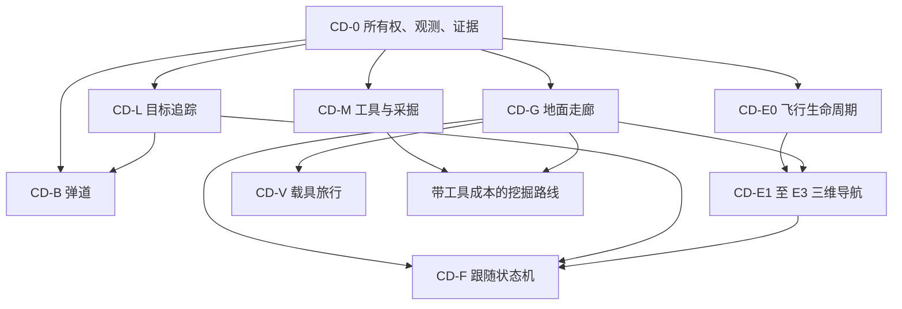

# Minecraft 能力深化总方案

日期：2026-09-14。状态：设计完成，尚未实施。本轮核对当前 AIRI 工作树和外置模组 0.2.14 源码。

上游：[需求草稿](./capability-deepening-draft.md)、[执行计划 §10](./minecraft-player-capability-execution-plan.md)。本轮不操作真机，不实现长期目标，不开启自由游玩。MC-0a 版本测试继续暂缓。

## 1. 目标与交付

目标是让已经存在的动作具备连续性、环境适应能力和可信结果。工具数量保持克制。模型提出目的，领域模块规划过程，客户端按游戏 tick 控制输入。

用户所说的“偏好正方向”指沿坐标轴交替运动，形成阶梯状路线和 Z 字抖动。本方案按这个含义处理。先前四象限对照只能排除简单平地的正负方向差异，不能证明运动流畅。

| 文档 | 对应需求 | 核心决定 |
| --- | --- | --- |
| [地面走廊与路径跟随](./movement-corridor-design.md) | Z 字抖动、绕圈、长路线共同基础 | 有碰撞约束的任意方向走廊、弧长游标、入口图 |
| [目标追踪与长距离定位](./target-tracking-design.md) | 草稿第 2 项 | UUID 固定、两级定位、来源与新鲜度明确 |
| [鞘翅三维导航](./elytra-navigation-design.md) | 草稿第 6 项 | 三维走廊、短时轨迹、可达落点与控制会话 |
| [空中跟随](./air-follow-design.md) | 草稿第 1 项 | 同一跟随命令切换地面和空中策略 |
| [投射物瞄准](./projectile-aiming-design.md) | 草稿第 3 项 | 版本化逐 tick 弹道、目标预判、同轨迹友军核对 |
| [工具与挖矿](./mining-tools-design.md) | 草稿第 4 项 | 游戏规则决定采掘资格，领域策略决定经济取舍 |
| [载具旅行](./vehicle-travel-design.md) | 草稿第 5 项 | 取得、路线、驾驶、停靠作为一个可恢复过程 |

本总方案拥有共同契约与排期。各专题只定义自身决策，避免复制一套租约、缓存或错误系统。

## 2. 最新修复核对

已存在的改动包括站位中心、不可变快照、开门不扣方块、主背包材料换槽、连续行走、失败记忆、区域目标和长路线切段。鞘翅已有走廊横向筛选、多组烟花、耐久刷新、附近落点与一次复飞。R8 数据包和 R9 当前目标位置、击杀关联、三叉戟回返也已有代码。

MODS 记录晚间塔至庭院飞行、低补给早降、投射物归属和备用三叉戟场景通过。本轮将其作为历史证据，未重复真机操作。

值得沿用的基础有三处：领域命令与 `MovementControlPort` 分开，让规划器能独立核对；客户端按真实使用和菜单流程执行，服务端结果回读已有基础；类型化回执和定向测试能逐步收紧能力承诺。下一步应扩展这些边界中的观测、控制和证据，保留已有动作语义。

现有 game-host 测试本轮重跑：**261 通过、1 跳过**。这说明既有场景仍成立，不能覆盖下表的剩余边界。

| 编号 | 本轮发现与证据 | 方案落点 |
| --- | --- | --- |
| D1 | `follow.ts:16` 只按动作和 parkour 分段，完整一格上升也进入纯行走段。离线复现 | CD-G1 的运动类型与动作边界 |
| D2 | `follow.ts:97` 默认从 `cursor + 1` 取前瞻点，首个拐点尚未到达就可能被跳过。离线复现 | 弧长前瞻与扫掠碰撞核对 |
| D3 | `follow.ts:112` 对 `Math.sign` 方向向量直接点乘。斜向向量未归一化，45° 转弯可能不减速。离线复现 | 连续切向与曲率调速 |
| D4 | `host-port.ts` 将缺失的 `get_self` 转成零坐标、`onGround:true`、`fallFlying:false`。离线复现 | CD-0 观测契约 |
| D5 | `planner.ts:214` 加了支配判断，但每个坐标仍只有一个记录。不可互相支配的材料状态会覆盖，父链也引用可变坐标记录 | 每个状态独立 ID、保留非支配标签、稳定父链 |
| D6 | `runTerrainRoute` 把直线等距点当作必须到达的目标，Y 线性插值。中间点可能在山体、空中或不可达侧 | CD-G3 的入口图与可达前沿 |
| D7 | 失败边最终变成整个目标格禁用。连续段失败记录段首，未使用返回的 cursor。失效只看目标格 ID，遗漏门属性和支撑变化 | 精确失败边及相关方块状态版本 |
| D8 | `shouldStop: () => writeStop.stopped` 仍引用可替换的共享变量，控制端口未携带执行身份 | CD-0 命令令牌和模组代次 |
| D9 | 进近中取消仍被 `!landing` 拦住。进近截止时间位于“距离没有改善”的分支，缓慢改善可延后超时。紧急降落无总期限 | CD-E0 独立截止与控制交接 |
| D10 | 所谓未知地形保守处理只覆盖“返回了空 ID”的情况。整次读取失败会跳过扫描，未加载格常被直接省略 | 明确覆盖掩码，未知不得变成空气 |
| D11 | `query_entities` 属于 `SERVER_FIRST_TOOLS`，双端点下是服务端查询。64 格是调用参数，草稿的“客户端半径”描述不准确 | CD-L1 按事实来源定义定位 |
| D12 | 当前区域/实体读常未传维度，`Levels.resolve` 缺省为主世界。切换后的停止成功不代表后续地形读一定正确 | 所有空间读显式携带并核对维度 |

代码证据位于 [movement](../../apps/stage-tamagotchi/src/main/services/airi/game-host/movement/)、[game-host/index.ts](../../apps/stage-tamagotchi/src/main/services/airi/game-host/index.ts)、[command-registry.ts](../../apps/stage-tamagotchi/src/main/services/airi/game-host/command-registry.ts)。外置模组入口为 `D:/mcpfabric/src`，关键类在各专题列出。

D1–D4 的 [独立复现](./evidence/capability-deepening-20260914/movement-boundaries.test.ts) 含 1 项对照和 4 项 `it.fails`。预期失败表示当前错误仍存在，不是修复已完成。D5–D12 为代码证据，尚未对应到用户某一次真机绕圈。

## 3. CD-0：共同契约先行

### 3.1 执行所有权

扩展既有命令 envelope 和 registry，不新增并行的顶层任务调度器。

| 字段或状态 | 语义 |
| --- | --- |
| `commandId` | 整次领域动作的身份，跟随切换移动方式时保持 |
| `controlSessionId` | 客户端一次输入所有权，具有单调递增代次 |
| `connectionGeneration`、`worldId`、`dimension` | 与现有绑定一致，旧绑定的指令不生效 |
| `sequence`、`goalRevision` | 同一会话内单调递增，过期更新直接丢弃 |
| `validUntilTick` | 客户端控制意图的短租约，用客户端自己的 tick 计时 |
| `running / revoking / cleanup / terminated` | 区分业务停止、输入撤销、必要清理和实际退出 |

执行入口捕获本条命令的固定令牌，之后不能重新读取全局“当前令牌”。控制端口和模组接收边界均核对身份。取消后，旧异步调用与旧 `finally` 都不能操作新会话。

模组拒绝旧 sequence。相同发射、放置或使用操作 ID 不重复执行。心跳只续约当前控制会话，普通观察请求不能延长已取消的驾驶。

registry 在取消后先拒绝新的冲突写动作，等待客户端撤销确认和执行器退出。超时可返回“停止未核实”，但不能因此把输入权交给第二个写者。连接消失时由现有 `ClientControlGuard` 清理，下一会话必须获得新代次。

空中取消可以由明确的安全降落子状态接管。原目标已撤销，降落拥有独立预算与期限。死亡或换维度直接释放输入。断线时只在客户端世界仍有效、缓存足够时执行有界自救，不能延续旧导航。

### 3.2 世界观测与新鲜度

空间观测必须包含：来源、来源 tick、主进程接收时刻、请求开始/结束时刻、世界和维度、连接代次、完整性与缺失原因。

客户端 tick、服务端 tick、主进程毫秒是三个时钟域。不得直接相减。跨来源比较使用各自序列与有误差的时钟映射。延迟和采样年龄进入预测误差预算。

地形快照增加状态调色板、碰撞形状、流体、危险标签和已覆盖区域。分别表达已知空气、已知障碍、未加载、截断与读取失败。查询遗漏的格子不是空气。返回的维度与请求不符时拒绝结果。

局部碰撞以客户端已加载世界的最新状态为准。服务端远处地形用于粗路线，并带来源标记。不能因为知道远处坐标就认为中间区块已加载。

### 3.3 能力与结果

连接时发现目标观测、碰撞快照、控制会话、弹道档案和破块证据能力。能力不可用时返回类型化限制。所有新契约由现有共享 game-host 类型拥有，IPC 沿用中央 Eventa 定义。

没有数据时不伪造零坐标、着地或库存。动作分开记录“已请求、已接受、客户端执行、服务器结算”。未观察到命中、掉落或取物时，结果保持未观察。

新原语是客户端领域任务边界，不全部暴露为模型工具。模型继续调用 `game_follow`、`game_move_to`、`game_shoot`、`game_break` 和 `game_collect`。

## 4. 算法与依赖取舍

| 候选 | 适用点 | 本轮决定 |
| --- | --- | --- |
| 现有 Movements/`A*` + 有碰撞约束的路径简化 | 保留跳、挖、搭桥语义，修复连续地面移动 | 先实施 |
| `Theta*` 任意方向搜索 | 纯行走区域的自然路线 | 列为后续对照候选，不直接替换全部动作图 |
| `HPA*` 风格入口图 | 大区域之间的连接与局部窗口 | 采用区域入口抽象，不采用直线插值作为路线 |
| Nav2 路径跟随与预测控制 | 前瞻、曲率、滚动轨迹评价 | 参考方法，不引入 ROS 运行时 |
| Baritone 鞘翅流程 | 起飞、航路与着陆职责 | 延续既定行为参照定位 |
| Prismarine 物理实现 | 离线对照与公式阅读 | 不把它当成本版本物理真值，不新增生产依赖 |

`Theta*` 允许路径方向脱离网格边，但 `Basic Theta*` 不保证真正的最短路径。它适合作为纯行走搜索候选，不能自动保留 MC 的开门、破块和材料状态。[论文](https://arxiv.org/abs/1401.3843)

`HPA*` 将地图划为区域并通过入口连接，可以减少大范围搜索。本项目需增加高度层、动作边和资源约束。[作者论文](https://webdocs.cs.ualberta.ca/~jonathan/PREVIOUS/Grad/Papers/jogd.pdf)

本轮选定的是算法职责和实现路线，没有选择新的外部库。后续若需要新增依赖，先由用户选择。

## 5. 统一实施顺序

| 批次 | 可交付结果 | 完成门 |
| --- | --- | --- |
| CD-0 | 新鲜观测与单一输入所有权 | 旧命令及旧清理不能触碰新命令，未知不会变成着地 |
| CD-G1 | 连续行走正确性 | 首拐点、上台阶、斜向转弯、失败定位回归通过 |
| CD-G2/G3 | 自然走廊与长路线 | 平地非 45° 斜线平顺，U 形与山脊绕行有效 |
| CD-L1/L2/L3 | 近处追踪、远处定位与运动姿态 | 同 UUID、同维度、新鲜度明确，来源切换不抖动 |
| CD-M1/M2 | 工具选择与可信采集 | 资格、耐久、破块和所得分开核对 |
| CD-E0/E1 | 飞行停止与模型校准 | 取消有界，轨迹模型经实际观测校准 |
| CD-E2/E3 | 三维航路与落地 | 侧向绕障、低顶棚、错过落点和无落点有确定结果 |
| CD-F1/F2 | 地空切换与持续跟飞 | 目标更新不触发重复起飞或自动降落 |
| CD-B1/B2 | 弓、弩、三叉戟弹道 | 按武器与场景记录命中、误差和拒射 |
| CD-V1/V2 | 船、马、矿车取得和旅行 | 按载具 UUID、路线与安全停靠闭环 |
| 后续增量 | 工具升级流程、投掷物扩展、复杂载具网络 | 各专题的基础闭环先通过 |

可先并行推进专题设计，实施按依赖图排序。避免一次同时修改寻路、物理、瞄准和回执，导致无法定位回归。

## 6. 证据与验收规则

每次试验保存命令与控制会话、目标和地图版本、来源 tick、输入、实际轨迹、计划轨迹、重规划原因、资源前后差与终止原因。复用现有调试日志和证据目录，不把轨迹塞进模型对话。

轨迹按客户端 tick 在有界环形缓冲中记录。事件切换立即保留。主进程按批读取，不能为每帧发一个 MCP 请求。主流程导出带版本与夹具 ID 的 JSONL/CSV，再生成对比图。

离线测试分三层：纯几何和状态机、协议重放、按输入推进的物理对照。假端口自动向目标移动，只能测编排，不能证明驾驶质量。

每个专题列有“需主流程采集”的场景。测试地图旋转、镜像并包含非 45° 目标角度。记录失败样本，不能只取成功轨迹。

阈值均为首轮工程建议，正式启用前由基线调整。成功率必须附分母和场景构成。友军误伤为零次观察不等于零风险证明。

## 7. 本轮检查与边界

- 现有测试：`pnpm exec vitest run --config apps/stage-tamagotchi/vitest.node.config.ts src/main/services/airi/game-host`，261 通过 / 1 跳过。
- 独立复现：[配置](./evidence/capability-deepening-20260914/vitest.config.ts)、[结果](./evidence/capability-deepening-20260914/results.json)，1 项对照 / 4 项预期失败。
- 桌面包类型检查：`pnpm -F @proj-airi/stage-tamagotchi typecheck` 通过。根目录没有名为 `type-check` 的脚本，本轮使用实际存在的包级脚本。
- 文档与复现材料的定向 ESLint、全仓 `pnpm lint` 均通过。全仓保留既有警告，输出见 [lint 日志](./evidence/capability-deepening-20260914/lint.log)。
- 本机 `javap` 已核对 1.21.1 的 `ItemStack.isCorrectToolForDrops`、`Player.hasCorrectToolForDrops`、`BlockState.getDestroyProgress` 与碰撞形状方法。方法存在不等于全部玩法都已覆盖。
- 没有修改生产代码，没有构建或写入外置模组，没有操作真机。需求草稿仍保留，后续实施以本方案及专题文档为准。
