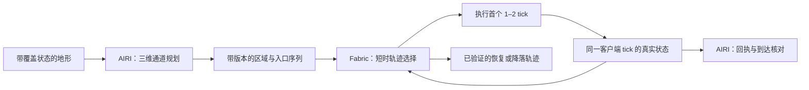

# 鞘翅飞行闭环修订方案

日期：2026-09-20。状态：提案，未实施。范围：先解决单程飞行，再接入跟飞。

实施入口：[鞘翅飞行闭环执行文件](./elytra-flight-control-execution-plan.md)。按 R0–R4 的前置条件与完成门推进。

本方案细化 [鞘翅导航设计](./elytra-navigation-design.md) 中已有的职责分工：AIRI 主进程规划任务与航路，Fabric 客户端预测短时运动并按游戏 tick 执行。它补充实现约束与验收顺序，不把已有实验改动登记为通过。

## 1. 需要解决的实际问题

目标是从真实起飞状态出发，沿已验证的空间进入洞口，在指定平台落地。每次失败必须能区分地图、航路、运动预测、控制执行和到达判定。

2026-09-20 对当前工作区的只读审查确认：

- `low-route.ts` 只验证候选列，没有验证两个候选之间的全部空间。用完整方块读取构造 `z=6` 石墙，采样点位于 `z=4/8`，仍返回穿墙到 `z=16` 的 `planned`。
- `elytra.ts` 丢弃规划结果的 `points`，只保存最远 `waypoint` 和一个 `bandY`。弯曲路线因此不能传到驾驶器。
- 同一平地斜向航线，玩家高度为 100、目标高度为 65，横向半宽从 4 扩为 16 后，读窗口变成 `y=94..108`，目标层完全缺失。请求仍只有 31050 格，但结果从 `planned` 变成 `blocked`。
- `lowRouteUsed` 表示任务曾经使用过航路，却持续影响紧急响应。它不证明当前位置仍受有效航路覆盖。
- 起飞宏使用烟花后，巡航仍以 `lastFireworkAt = 0` 初始化预测。预测没有继承起飞推进状态。
- rollout 的 1–2 tick 执行前缀没有传到实际执行期限。主进程循环等待至少 200ms，还要串行读图，然后才更新位置。

现有低航路单测 22/22 通过。上述反例说明测试覆盖范围仍有缺口。关闭 rollout 后的三次实测最低高度均为 74，且提前结束；最高高度降低还不足以证明下降管理通过。

## 2. 成功必须经过四个独立判定

| 判定 | 输入 | 允许的结论 |
| --- | --- | --- |
| 空间连通 | 带覆盖状态与碰撞形状的地图 | 存在连接起点与终点区域的空间通道 |
| 运动可行 | 通道、真实速度、姿态、推进状态 | 当前状态可以执行下一段，且段末仍有可行后续 |
| 实际执行 | 客户端 tick、实际输入与位置 | 游戏按选定前缀执行，偏差处于已测范围 |
| 任务到达 | 新鲜位置、支撑面、速度与世界绑定 | 在指定目标区域落地；洞顶或附近替代落点不能算目标到达 |

几何路线只进入运动验证。预测通过只允许执行短前缀。只有最后一项可以产生任务成功回执。

## 3. 地图：读量上限与空间覆盖分别验证

主进程沿航路需求读取固定尺寸三维块，并缓存各块的世界绑定、来源、时刻和覆盖状态。横向扩展时增加块数，达到总预算后明确返回覆盖不足。不能通过悄悄裁掉目标层来维持单次请求大小。

例如 16×16×16 个方块是一份 4096 格的请求。多个相邻块拼接可覆盖横向绕行和上下通道。这里使用格数定义尺寸；桥接坐标是闭区间，最大坐标为最小坐标加 15。总读量、请求数、缓存容量与耗时另设预算，具体值通过采集决定。

优先读取当前运动前方、路线入口、备选落点和决定岔路的边界。地图快照可以分时更新，但每块保留自身时间，不能把多次读取伪装成同一 tick 的世界快照。

复用 `movement/observation.ts` 的六态覆盖语义，并在所属数据边界保留碰撞形状及其精确性。当前 `getBlocksRegion` 的扁平条目不能独自表达全部来源信息，接线必须补齐。客户端与服务端状态冲突时，短时控制以客户端新鲜碰撞状态拒绝执行，主进程使受影响通道失效。

植物可穿过与植物可承重是不同属性。空气、无碰撞形状、流体、支撑面和危险标签分别处理。水面可以是明确选择的应急结局，不作为普通滑翔空气或普通平台。

## 4. 航路：从目标所在空间出发，允许沿途升降

目标锚定保留为“选择包含目标的空气区域”。它不要求所有沿途列都包含 `goal.y + 1`。

在已知自由空间中建立区域与入口图。初版使用有界三维格点搜索，复用 `flight/corridor.ts` 的搜索职责。开阔处可用较粗格点，窄通道细化到方块尺度；粗单元内部有障碍时不能直接丢弃其中的窄通道。每个执行区域必须经过保守的自由空间验证。

同一水平位置可以存在洞内、洞顶上方等多个空气区域。它们只有在地图证明存在连接入口时才连通。自由空间不要求每个单元附近都有地面；支撑面是落点选择的条件。

每条图边验证整个连接段、所需碰撞盒和净空。斜向边不能穿过两个方块夹角。简化折线或合并区域时重新验证生成的体积，不能用包围盒把拐角内侧障碍包进可飞走廊。

如果目标区域已加载，可以从该区域建立到目标的图上距离，并用于路线选择。如果目标未加载，只能规划到已覆盖的前沿区域，结果明确标记为局部路线。目标坐标只用于选择探索方向，不能证明目标侧地形或通道存在。

在本夹具中，同时评估“沿河道绕东岸”和“越岸后下降”两类空间路径。不能预先规定必须爬到 85，也不能预先规定全程保持 66。地图决定空间路径，后续运动验证决定哪条能飞。

首轮限制搜索节点、总读量与运行时间。局部窗口没有路线时，依次扩大横向、纵向或高度覆盖，扩展方向由阻塞边界决定。超过预算返回具体原因，不转成直飞终点。

输出保留有序区域、入口、净空、地图版本、未知边界和终端目标。最终高度由当前路段约束，不再由一个全程 `bandY` 控制。

## 5. 控制：从当前运动状态选择短时输入

Fabric 客户端成为该飞行会话唯一的 yaw、pitch 与烟花写入者。主进程发送通道、目标和任务预算，不再同时发送巡航 `look/useItem` 命令。`BotController` 保留统一输入仲裁，新的飞行业务模块拥有飞行状态与预测。

每次预测读取同一客户端 tick 的位置、速度、姿态、滑翔状态、装备和推进状态。观测同时记录采集阶段，例如移动前或移动后；预测更新顺序必须与实际应用阶段一致，tick 编号相同并不自动证明状态对齐。起飞与巡航在同一所有者内交接这些状态。烟花使用携带唯一操作 ID；重复命令不能重复点火。当前推进剩余量从真实状态读取；若目标版本无法提供精确剩余量，则记录有依据的上下界，并验证该范围内的候选，不能默认归零或把一次实测寿命用于所有烟花。

局部控制沿有序入口推进。候选目标来自当前区域和后续可达入口，代价计算沿路线的进展。不能因直线距离更短而跳过河道拐弯。前视距离随速度和局部可转向空间调整，跨越入口前验证完整预测轨迹。

候选使用少量分阶段控制原语，例如转向、保持、俯冲、拉平和一次点火。先用既有 Minecraft 动力学预测未来运动，再排除碰撞、未知区域、违反会话期限和无法保留后续路径的候选。只在剩余候选中比较路线进展、净空、输入变化和资源消耗。转头后的速度向量必须继续进入预测，不能认为 yaw 改变就已经完成转弯。

首轮建议每 1–2 tick 更新轨迹，预测窗口从现有回放使用的 20–40 tick 范围评估。现有直线、缓慢转向和单次助推证据不能覆盖所有候选；陡降、连续转向、起飞交接和不同推进剩余量必须补测。模拟步数与耗时同时有上限；这些是待验证的运行参数，不是现有性能结论。一次候选若超出已读取空间，应请求扩大相关地图或缩短任务推进，不能用每次当前位置的 `y−4..y+12` 作为永久高度规则。

所有世界访问在游戏线程完成。重计算若需要后台线程，只消费不可变快照。结果应用前重新核对会话、地图、起始状态误差与过期 tick；迟到结果直接丢弃。客户端 tick 不等待 MCP 或后台计算完成。

选中的轨迹只执行首个 1–2 tick。下一次按实测状态重新选择。碰撞检查使用姿态碰撞盒沿整段运动的扫掠，并加入按档案校准的误差余量。不能以任意固定数量的离散采样点宣称不会漏过薄墙。

## 6. 前进之前，检查还能怎样退出

鞘翅不能在未知边界原地等待。每条被接受的短轨迹，其末端状态都必须有一条当前地图与资源允许的后续轨迹：继续进入已知通道，或转入可达落点。回转只在转弯空间经过验证时可选。

已知后续不能无限接力却没有终止能力。实现中保留一个可达的恢复或落地终端，并在滚动预测中验证接入它的剩余路径与资源。首轮可限制为能证明应急落地路径的场景；复杂回转另行扩展。

计算超时或网络延迟时，只能执行仍有效、且当前误差允许的旧轨迹剩余前缀。它到期前必须切入已经验证的后续。不能保持一个旧 pitch 无限等待，也不能把“曾经规划成功”当成当前位置安全。

如果动态地形变化使主路径和后备路径都失效，报告 `no_viable_trajectory` 并进入有界的最小风险收尾。该情况不具有成功或无碰撞保证，不能伪装成安全降落。

这借鉴了 [FASTER](https://arxiv.org/abs/2001.04420) 在已知自由空间中保留备用轨迹的原则。这里是适配 Minecraft 的工程提案，论文的飞行器模型与安全证明不能直接用于鞘翅。

## 7. 会话、地图与到达契约

继续沿用 `command-registry.ts` 的任务身份、单写入者和输入会话。通道更新至少绑定世界、维度、连接代次、控制会话、目标修订和通道版本。客户端拒绝旧版本与错误所有者，确认接受后才切换当前通道。

几何地图的来源时间与控制期限分别记录。客户端 tick 用于轨迹执行期限，主进程时间用于网络与任务预算；两者不得直接相减。暂停恢复后先核对真实状态和会话有效性，旧异步结果不能恢复已撤销的行动。

取消立即改变任务原因并停止向原目标推进。客户端在当前输入所有权下执行有界收尾。回执分别报告取消请求、控制权释放和实际接地；业务取消不意味着惯性已经消失。断线、租约失效和死亡进入同一所有权清理路径，旧会话不得恢复点火。

进近仍使用同一套通道和轨迹约束。进入 Approach 的条件包含：进入选定进近区域、方向可接受、当前速度与剩余空间支持接地。距离终点 80 格本身不是切换条件。

在洞口前完成所需转向和下降；洞内保留屋顶、侧墙与落点的约束。接地同时验证目标区域、支撑面、高度、`onGround` 和残余速度。落在洞顶、落到应急平台或水中分别报告，不作为目标成功。

## 8. 现有模块如何收敛

| 现有模块 | 修订后的职责 |
| --- | --- |
| `movement/observation.ts`、`region.ts` | 地图覆盖、来源、时刻、形状与有界读取 |
| `flight/corridor.ts` | 三维区域与入口搜索，输出完整通道 |
| `flight/low-route.ts` | 将目标空气槽选择整合进通道规划；移除独立的全程高度决策 |
| `flight/simulation.ts`、`rollout.ts` | 保留离线预测、候选语义与回放验证；为 Java 执行器提供一致性对照 |
| `flight/live-port.ts`、`live-corridor.ts` | 收敛到通道交换与状态读取，退出实时输入控制 |
| `movement/elytra.ts` | 装备、任务生命周期、通道更新与回执核对 |
| MCPFabric 客户端飞行模块 | 实时状态、轨迹选择、逐 tick 控制、恢复与接地 |
| MCPFabric `BotController` | 全局输入所有权与飞行模块接线 |

TS 与 Java 的预测不能各自修改常数后继续声称一致。版本档案、烟花条件和同一批真实输入轨迹必须进入交叉回放。模型生成的轨迹可用于一致性测试，但不能充当真实游戏校准证据。

这里不新增通用工具库，也不选定外部运行依赖。已查阅的复用方向如下，实际引入依赖需另行选型：

| 候选 | 本轮用途 | 尚需解决的适配 |
| --- | --- | --- |
| AIRI 现有 corridor、simulation、rollout | 本提案的优先复用边界 | 数据覆盖接线、完整路径消费、客户端执行与模型交叉验证 |
| [Baritone Elytra](https://github.com/cabaletta/baritone/blob/master/src/main/java/baritone/process/ElytraProcess.java) | 参考游戏内逐 tick 驾驶及路径管理 | 其流程与 Nether 寻路上下文耦合，需要单独评估通用峡谷与洞内降落 |
| [FASTER](https://github.com/mit-acl/faster) | 参考已知空间中的备用轨迹原则 | 原实现依赖 ROS、Gurobi 和不同动力学，不能直接替换现有执行器 |

## 9. 实施顺序与完成门

| 批次 | 工作 | 完成门 |
| --- | --- | --- |
| R0 证据冻结 | 保存代码摘要、模组构建标识、地图片段与逐 tick 轨迹；修正候选值与实际输入混淆的日志 | 同一失败能离线重放，并能区分预测、选择、实际应用三个时刻 |
| R1 空间路径 | 地图分块、完整覆盖与形状、连通图、三维通道 | 薄墙必拒绝；密封洞不连通；弯河可绕；多层顶棚目标选对；扩大窗口不丢目标层 |
| R2 客户端驾驶 | 在预先验证的简单通道上实现逐 tick 控制、推进交接与执行期限 | 开阔地的下降、转弯、起飞交接通过；人为延迟 MCP 不延长控制前缀 |
| R3 航路闭环 | 将 R1 通道接入 R2，加入过期重规划和后备轨迹 | 可处理绕岸、升降组合、短暂读失败、地图变化和取消，不直飞未验证空间 |
| R4 进近与综合验收 | 同一通道约束下进洞、拉平、接地与回执 | 指定洞内平台真实落地；洞顶误到达为零；失败原因和收尾完整记录 |

R1 不需要消耗烟花。R2 先使用已验证的简单地图，隔离驾驶问题。两项通过后再在完整峡谷验证组合，不用整程反复坠机代替单项定位。

首轮建议保留旧设计要求的每类至少 20 次验收，并先做少量诊断运行。对固定夹具使用若干起始姿态与推进剩余状态，完整保留失败。具体健康、落点误差、耗时和烟花预算在首轮数据后冻结；不得在看到失败后放宽同批门槛。

复现用例必须包含：采样间薄墙、斜向切角、起点与低槽之间有顶盖、封闭洞穴、多层顶棚、先升后降、弯道速度过高、未加载目标、部分截断、规划超时、旧修订重放、起飞烟花仍在推进、推进持续时间未知、进近取消和客户端暂停恢复。

## 10. 可观测性与已知限制

每个应用 tick 记录会话、目标修订、通道版本、地图来源时间、规划起始 tick、实际应用 tick、位置、速度、推进状态、当前入口、选择的输入、执行期限、后备轨迹标识与退出原因。候选高度与实际命令高度分开记录。

失败分别归类为 `map_incomplete`、`no_geometric_route`、`search_budget`、`no_viable_trajectory`、`prediction_mismatch`、`stale_plan`、`control_revoked` 和接地失败。名称为提案，最终复用所属契约已有枚举。

动态障碍、服务端纠正和超出校准范围的运动仍可能使后备轨迹失效。本方案的目标是让这些条件可识别、可收尾，并把已验证的适用范围写清楚。它不承诺任意地形、任意服务器延迟下无碰撞。
