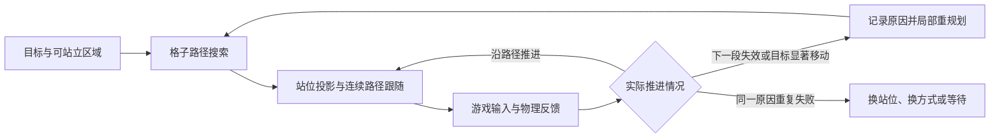

# Minecraft 能力复审与移动改进建议

日期：2026-09-14。范围：AIRI 当前工作树、`D:/mcpfabric` 当前源码、本机 1.21.1 映射后的游戏字节码。

本轮为审查。新增复现材料，没有修改运行时代码，没有重跑真机场景。长期目标和自由游玩仍按设计阶段处理。

## 1. 审查结论

这一轮能力提升已经落到代码。装备、持续使用物品、容器、工作台、熔炉、生存动作、远程武器、落地水、激流和生活交互，都有可追踪的执行链路。现有真机记录也覆盖了许多实际操作。

当前主要短板转为三类：连续移动的控制质量、复杂场景的规划状态、动作结果的严格归属。再增加工具数量，不能直接解决这些问题。

用户报告的频繁重规划、绕圈和 Z 字抖动，有多条具体代码线索。其中，角点瞄准、搜索污染快照、材料记账、目标坐标和飞行扫描已通过定向测试复现。每次真机绕圈究竟触发了哪条链路，仍需轨迹记录。

建议先完成移动基础修复和停止控制，再扩展自主探索。自主探索会反复使用这些能力，也会放大重复失败。

### 证据口径

| 标记 | 含义 |
| --- | --- |
| 复现 | 本轮测试通过现有公开模块入口，触发了错误行为 |
| 代码证据 | 问题可从源码或本机字节码直接推导，尚未补做对应真机场景 |
| 推断 | 代码可以解释用户现象，尚无该次真机轨迹来建立对应关系 |
| 历史验收 | 最近文档记录的真机结果，本轮未重新执行 |

主要文档包括 [MC-3c 真机记录](./evidence/mc-3c/live-acceptance-20260913.md)、[MC-4 真机记录](./evidence/mc-4/live-acceptance-20260914.md)、MC-4a–f 规范、[能力执行计划](./minecraft-player-capability-execution-plan.md) §9 和 [MODS](./MODS.md)。本次以工作树为准，包含尚未跟踪的新增代码。

## 2. 最近改善核对

| 能力 | 已有基础与证据 | 尚未覆盖的边界 |
| --- | --- | --- |
| 装备与物品使用 | `game_equip`、`game_use`，模组区分蓄力、正常释放和中止，观察包含装备、效果和使用状态 | 快照字段丰富不等于具有完整地形理解 |
| 容器与生产 | 菜单身份、槽位、3×3 合成、熔炉进度和分段装料/领取。MC-4b 有历史验收 | 跨多个工位的补料、等待、运输仍需上层流程 |
| 生存连续性 | 补给、睡眠、重生、跟随、采集。跟随小数目标在 `runTerrainLeg` 已修复 | 直接 `move_to` 尚有相同坐标问题。采集归属、凹洞拾取仍有限 |
| 弓、弩、三叉戟 | 模组 tick 驱动使用周期，发射数有投射物、耗弹或装填清除证据，具有取消和友军阻挡 | 移动目标定位、弹道、击杀归属、备用三叉戟干扰仍需修正 |
| 落地水与激流 | 反射和模组执行接近游戏 tick，历史验收包括落地水、水中/雨中激流、条件失败 | 天气同步、耐久采样时序仍在 backlog |
| 鞘翅与炽足兽 | 塔台起飞、跨山和水岛着陆、低补给、熔岩横渡已有历史验收 | 任意起飞点、三维绕障、应急落点和停止后的控制权尚不完整 |
| 生活交互 | 放置、书/告示牌、附魔、石切机和织布机按钮已有实现及记录 | 铁砧改名和交易选择缺服务器数据包。信标已明确需要专用原语 |
| 世界绑定 | 维度变化的类型化停止原因已修复，并有历史验收 | 无玩家时连接造成的 `worldIdentity` 缺失，仍是独立问题 |

MC-4 记录最后一条结论为全部 PASS，服务端也已升到 0.2.12。文档前部的待测状态属于中间记录。这个结论适用于当时列出的验收场景，不能据此认为所有变体都已覆盖。

## 3. 优先处理的发现

P1 表示会破坏结果正确性、停止语义或常用移动。P2 表示复杂环境中的规划质量和能力边界。

### R1 · P1 · 格子角点被当成行走目标

位置：[movement/executor.ts](../../apps/stage-tamagotchi/src/main/services/airi/game-host/movement/executor.ts)，`walkStep`，约 280–310 行。

**复现**：玩家位于 `(0.5, 1, 0.5)`，下一格为 `(1, 1, 0)`。执行器直接瞄准整数角点，首次 yaw 为 `-135°`。瞄准下一格可站立中心时应为 `-90°`。

此外，到达每个节点都会 `stopMovement`。朝向误差超过 25° 才更新，节点到达半径为 0.45 格。连续奔跑又没有提前减速和越过节点的判定。这些机制可以导致反复校正和折线运动。

**建议**：区分整数格坐标和实际脚部站位。普通完整方块使用 X/Z 中心，Y 来自支撑面的真实高度。楼梯、半砖、门和水不能套用统一的 Y 偏移。纯行走段按连续路径跟随，只在动作边界、终点和停止时停下。

**范围**：测试复现了瞄准错误。持续 Z 字运动的幅度和是否绕圈，仍需真机轨迹核对。

### R2 · P1 · 搜索候选会修改共享世界快照

位置：[movement/movements.ts](../../apps/stage-tamagotchi/src/main/services/airi/game-host/movement/movements.ts)，`getMoveJumpUp` 约 216 行，以及 [snapshot.ts](../../apps/stage-tamagotchi/src/main/services/airi/game-host/movement/snapshot.ts) 39 行。

**复现**：`blockC.height += 1` 用于假设放置后的高度，但 `getBlock` 返回快照中原对象。仅调用一次邻居枚举，原方块高度就改变。其他候选随后会把假设状态当成真实世界。

这会破坏同一次搜索的一致性，也能让下一次新快照得出的路径不同。它是路径不稳定的一条原因，但尚不能归因到某次具体绕圈。

**建议**：快照保持不可变。候选的支撑高度用局部计算。确需表达已规划的放置和破坏时，将这些变化归属于候选路径状态，并核对状态合并规则。

### R3 · P1 · 材料状态不足以支持可靠搭桥

位置：`movements.ts` 167 行，[planner.ts](../../apps/stage-tamagotchi/src/main/services/airi/game-host/movement/planner.ts) 147、180 行，以及 `executor.ts` 的材料选择。

**复现**：开门也放在 `toPlace` 数组，统一减去数组长度。零个方块开门后变为 `-1`，后续 `=== 0` 的守卫不能拒绝负数库存。

**代码证据**：搜索记录只按坐标合并，没有区分剩余材料。先到达同一位置的便宜路径可能已经耗尽材料，较贵但保留材料的路径会被丢弃。主进程统计主背包和快捷栏，放置执行器却只从快捷栏选择材料。可用列表还包含沙子。

**建议**：只对真正的放置动作扣材料，拒绝不足预算。状态合并保留“成本更低且材料不少”的优势状态。每次动作和重规划后刷新库存，必要时将材料移入快捷栏。悬空搭桥先限制为稳定完整方块，并核对支撑面、放置面和服务端落块。

### R4 · P1 · 小数目标修复未覆盖直接移动

位置：[game-host/index.ts](../../apps/stage-tamagotchi/src/main/services/airi/game-host/index.ts)，`executeTerrainMoveTo` 约 1734 行、`runTerrainLeg` 1763 行，以及 `planner.ts` 168 行。

**复现**：平地目标 `(4.5, 1, 0.5)` 无法匹配整数图节点。跟随和采集通过 `runTerrainLeg` 取整，但直接 `move_to` 仍原样传入。只要起点尚未处于容差内，搜索就会遇到这个问题。

**建议**：短期统一坐标入口。后续改为目标区域：到达某个范围内、可站立且满足交互条件的位置。跟随无需进入目标实体的格子，采集无需站到未破坏的原木内部。容差应参与搜索终止条件。

### R5 · P2 · 重规划没有保留失败经验，调用方会再次尝试同一路线

位置：`executor.ts` 约 369–429 行，`index.ts` 的 `follow` 和 `walkNear`。

**代码证据**：单次 `runTerrainMove` 并非每 tick 重规划。它先执行路径，节点失败后做跳跃、侧移或后退，再重新读取并搜索。新的搜索没有失败边记录。`follow` 完成或失败一条移动腿后，又从新一轮开始。

采集站位回退顺序固定为“目标、+X、−X、+Z、−Z”。这些位置逐个独立搜索，未共同比较路径成本。这里确有固定方向优先级。

**推断**：同一失败边被重复选中、跟随不断追逐上一腿的旧位置、角点控制超时，都能表现为反复重规划。恢复动作和站位切换还能表现为绕圈。

**建议**：保留有效路径前缀和执行游标。记录失败边、失败原因和对应世界版本。跟随目标超过距离阈值才更新路径，反复不可达时进入明确等待状态。采集将所有可交互站位作为一个目标区域搜索。

### R6 · P1 · 鞘翅扫描不等于实际飞行通道

位置：[movement/elytra.ts](../../apps/stage-tamagotchi/src/main/services/airi/game-host/movement/elytra.ts)，`scanTerrainAhead`，约 346–393 行。

**复现**：沿 X/Z 对角线飞行时，障碍 `(6, 100, 32)` 距实际中心线约 18 格，仍触发 `-30°` 爬升。

扫描读取前方端点的轴对齐矩形，之后只核对前向投影，没有横向距离筛选。同时只扫描当前 Y 的一层方块，宽度还依赖浮点方向分量恰好等于零。不同航向的覆盖几何并不一致。

**建议**：近期先修正横向距离、垂直厚度和未知地形语义。之后按当前速度预测短时轨迹，核对玩家体积沿轨迹扫过的空间。矩形可以作为读取范围，但不能作为碰撞结论。

### R7 · P1 · 飞行停止、应急降落和输入清理未形成完整生命周期

位置：`elytra.ts` 约 78–123、125–145、213 行，`index.ts` 的 `stopGameAction`，以及 [command-registry.ts](../../apps/stage-tamagotchi/src/main/services/airi/game-host/command-registry.ts) 的 `requestStop`、`stopActive`。

**复现一**：进入进近后才停止，`!landing` 条件使取消不再改变执行器内部原因。局部执行器仍返回 `reached`。外层 registry 能把最终回执改为取消，因此这不是“外层必定报告成功”的结论。

**复现二**：起飞期间已按下前进和疾跑，随后状态读取抛错。负责清理输入的 `finally` 尚未进入，输入没有释放。

**代码证据**：巡航超时只在 `!landing` 时生效。进近没有独立截止时间。取消、低补给和低血量仍围绕原始目标降落，没有重新选择附近落点。停止函数等待执行器的 `Promise.race` 超时后也能报告已经停止。registry 可以先结算，而旧循环尚未退出。

主进程还有共享的 `stopRequested` 和单个 `inFlightExecution`。新执行入口会清掉前者，包括读取动作。只靠共享布尔值不能保证已停止任务永久失去控制权。

**建议**：每条写命令持有可撤销的执行令牌。所有控制调用都核对所属命令、连接代次和维度。取消先撤销旧任务，再由唯一控制者接管有期限的安全降落。关闭连接或绑定变化后，旧任务不能再发输入。把“回执已结束”和“执行器已退出”作为两个明确状态核对。

起飞到降落全程置于清理边界内。进近、复飞和紧急降落分别有截止时间、落点与补给预算。

> **同日进展（2026-09-14）**：R8 已修复并复测通过（模组 0.2.13：`select_trade` 发 `ServerboundSelectTradePacket`、`set_name` 发 `ServerboundRenameItemPacket`）；真机证据见 [MC-4 真机记录](./evidence/mc-4/live-acceptance-20260914.md) 的 “R8 修复复测”。R1–R7、R9 仍开放。

### R8 · P1 · 铁砧改名和交易选择缺服务器同步

位置：`D:/mcpfabric/src/client/java/dev/mcpfabric/client/handlers/MenuHandlers.java`，259、282 行。

**代码证据**：`menu.setItemName`、`setSelectionHint` 和 `tryMoveItems` 只调用本地菜单方法。源码注释说它们会发送服务器数据包，与本机 1.21.1 字节码不符。

原版 `AnvilScreen` 在改名后另外发送 `ServerboundRenameItemPacket`。`MerchantScreen` 在选择后另外发送 `ServerboundSelectTradePacket`。本轮核对过程见 [协议核对记录](./evidence/movement-review-20260914/protocol-check.md)。

MC-4f 对这两项的历史证据分别为“结果槽命名生效”和“输入/产物槽出现物品”。这些证据尚不足以排除客户端预测结果。

**建议**：参照已修复的 `menu.button`，发送相应原版数据包。随后核对服务器同步结果。铁砧应取出成品、关闭菜单、重读名字和经验消耗。交易应核对扣款、产物进入背包、交易次数，并覆盖非首条和输入相同的交易。

> **同日进展（2026-09-14）**：R9 已修复（模组 0.2.14 + AIRI）：瞄准每 tick 重读目标并按飞行时间预判、死亡事件补攻击者/投射物 UUID、击杀归属不可关联时保持未观察、忠诚返回按已发投射物/库存差判定。真机验收待做。

### R9 · P1/P2 · 远程武器仍有目标与结果归属缺口

位置：`D:/mcpfabric/src/client/java/dev/mcpfabric/client/BotController.java`，`aimAtTarget` 约 1083 行、忠诚返回检测 897 行。另见 `index.ts` 2641 行，以及 `D:/mcpfabric/src/main/java/dev/mcpfabric/handlers/GameEvents.java` 的死亡事件。

**代码证据**：瞄准以发起射击时的 `combatTargetX/Z` 为基准，再加当前速度的有限偏移。目标已移动数格后停下时，X/Z 又指向旧位置。友军检测也使用旧目标坐标。

死亡归属只核对目标 UUID 和 `arrow/trident` 死因。死亡事件没有攻击者和投射物 UUID，因此其他玩家的远程击杀也能被归到当前射击。忠诚返回则检测背包里是否存在任意三叉戟，备用三叉戟可以造成假阳性。

**建议**：先用 UUID 获取目标的当前坐标，再做预判。击杀关联命令、发射时刻、射手和投射物。仅知道目标死于箭时，保留目标死亡事实，击杀归属保持未观察。忠诚返回结合已发投射物和发射前后物品变化判断。

弹道补偿另开阶段。目标预判应使用预计飞行时间，而非直接用蓄力 tick。友军阻挡也应沿同一预测弹道核对。

## 4. 如何解释方向偏好与绕圈

本轮平地测试分别规划 `(±6, 1, ±6)`。四个方向均得到六个斜向节点，成本都是 `6√2`。因此当前 A* 已支持斜向移动，没有证据表明它在所有场景都只走坐标轴或只偏正方向。

这也不能排除复杂地形的方向偏差。固定候选顺序、相同代价的选择、扫描覆盖差异和动作恢复，都可能造成局部偏好。应对同一地形做旋转和镜像测试。



当前最容易混淆的是三种现象：路径真的重新搜索、执行器反复追同一节点、上层重新发起移动腿。日志需要分别记录它们。

建议每次记录 `commandId`、`legId`、`planId`、重规划原因、目标版本、世界版本、当前路径进度、实际坐标、跟随点、速度、朝向误差和失败边。低频记录正常轨迹，状态切换和失败时保留完整上下文。

进度应以沿当前有效路径前进了多少来衡量。单看离最终目标越来越近，会误判必要的绕障。单看最近是否移动，又会漏掉有位移的绕圈。现有 `walk ... at ...` 调试消息使用移动前的 `position`，也需改用该步结束时的实际位置。

## 5. 地面移动的实现顺序

### 第一批：修正坐标、世界状态和停止所有权

处理 R1–R4、R7 中的输入清理与执行令牌。建立整数格、脚部站位和目标区域的统一契约。原始快照不可变，假设动作状态单独存储。

这批完成后，普通平地八方向、跨零坐标、小数目标、零材料开门、起飞读失败都应有稳定结果。单纯调大到达半径或增加重试次数不能替代这批修正。

### 第二批：实现连续路径跟随

路径按“纯行走段”和“必须执行动作的边界”处理。纯行走段选择前方可直达的跟随点，跟随距离随速度变化。弯道和终点提前减速。已经越过的节点不再追着往回走。

直达核对需要覆盖玩家宽度、高度和支撑面。跳跃、开门、破坏、搭桥与立柱不能被平滑过程跳过。先保证路线可执行，再减少折线和停顿。

现有仓库已安装的 `mineflayer-pathfinder` 2.4.5 在 `postProcessPath` 中有站位投影，也有带物理可行性核对的可选捷径处理。它的捷径默认关闭。这里适合补齐移植时缺少的契约，再按 MC 真机效果评估开启范围。[上游项目](https://github.com/PrismarineJS/mineflayer-pathfinder)

控制方法可参考 Nav2 的 Regulated Pure Pursuit。它包括随速度调整跟随距离、按曲率减速和预测碰撞。这些方法不能直接替代 MC 的输入、摩擦和碰撞模型。[官方文档](https://docs.nav2.org/rolling/configuration_and_development/configuration_guide/controller_plugins/configuring_regulated_pp/)

### 第三批：让重规划具有明确原因

只在下一段失效、偏离可行走廊、目标显著移动或动作条件变化时替换路径。小幅目标移动使用阈值和滞后区间，避免来回切换。障碍突然出现时仍须立即处理。

失败记录按边、动作、地形版本和材料条件保存。条件改变后可以重试，避免永久禁止一片区域。新路径没有明显收益时保留有效前缀。连续失败后换交互站位，或返回结构化失败交给上层决策。

远距离移动改为粗路线加局部窗口。当前把起终点包进大矩形再读取，会让斜向长距离任务读取许多无关方块。局部窗口之外保留未知状态，不能当作空气。

## 6. 鞘翅需要飞行路线与落地计划

当前实现围绕目标坐标调 yaw/pitch，遇障主要爬升。它已能完成受控场地飞行，但还没有表达“从哪起飞、从哪侧绕山、以什么速度和方向进近”。

建议沿用主进程与模组的现有边界。主进程负责目的地、航路、候选落点和资源预算。模组负责每 tick 的输入控制、短时轨迹核对和反射抢占。网络轮询不承担最后几 tick 的避撞。

| 阶段 | 需要补齐的决定 |
| --- | --- |
| 起飞 | 选择可达起飞位，核对前方空间和落差，失败后更换候选 |
| 巡航 | 搜索可通行的三维走廊，比较左右绕行、爬升和改道的代价 |
| 局部控制 | 从当前速度推算有限个候选轨迹，核对碰撞、转弯能力和烟花消耗 |
| 进近 | 先选择落地区域与进入方向，再安排下降和减速，保留复飞空间 |
| 紧急降落 | 从当前位置选可达落点，取消原目的地任务，按剩余高度和补给限制操作 |
| 结束 | 核对落地状态、空间位置和残余速度，释放输入并归还控制权 |

短时预测必须使用目标游戏版本的鞘翅运动规律。按当前速度扫描倾斜的三维空间，覆盖转弯时的惯性。地形读取范围可以宽，但碰撞判断必须针对候选轨迹扫过的玩家体积。

候选不必一开始就很复杂：有限的左右转角、俯仰角和烟花使用选择即可。只执行当前最合适的一小段，取得新状态后再选择。若所有候选都不可行，则转入明确的降落或失败处理。

落点应是可落地区域，不能只是一个坐标。接近地面时仍要核对地形，不能将最后 16 格全部免检。飞过目标后应进入有预算的复飞流程，不能不断把机头扭回同一个点。

补给也需要实时状态。目前烟花槽只选一次，总量靠本地减一。多组烟花需要重新选择可用槽位，鞘翅耐久也应在飞行中刷新。应急预算应留给可达落点，而不是继续朝原终点下降。

Baritone 的 1.19.4 `ElytraProcess` 可用于参考起飞位搜索、路径管理和着陆状态的职责划分。该实现也记录了找不到落点时可能持续盘旋的限制，不能视为通用解决方案。本建议继续沿用现有实现路线。[对应源码](https://raw.githubusercontent.com/cabaletta/baritone/1.19.4/src/main/java/baritone/process/ElytraProcess.java)

## 7. 原有底子值得保留的部分

**领域动作和命令回执**：`game_equip`、`game_shoot`、`game_smelt_*` 让上层表达实际游戏行为。registry 已有绑定、期限、幂等和后条件。下一步是把这套归属延伸到每次底层输入。

**接近游戏 tick 的反射与使用周期**：落地水、物品蓄力、中止与发射计数已经放到适合控制时序的位置。连续移动可以复用这种职责划分。

**规划、快照和控制端口已经分开**：本轮可以直接调用生产模块，独立复现坐标、状态和控制问题。保留这个边界，有利于修正算法而不重写工具接线。

**真实结果的读取意识**：熔炉分段、菜单身份和物品变化读取都有价值。按钮区分 `sent/applied`，命中缺少证据时保留未观察。菜单同步和击杀归属需要沿这条方向继续收紧。

**文档与真机证据相互补充**：最近记录不仅包含成功，也记录了小数目标、按钮数据包和客户端死锁的根因。当前应把“命令被接受、客户端发生变化、服务器实际结算”分别写进验收，避免同类问题再次漏过。

## 8. 测试结果与下一轮验收

本轮重跑现有 game-host 测试：**204 通过，1 跳过**。新增独立审查测试：**1 项对照通过，7 项预期失败复现**。

`pnpm -F @proj-airi/stage-tamagotchi typecheck` 和全仓 `pnpm lint` 通过，lint 仍有既有警告。仓库没有 `pnpm type-check` 命令，因此类型核对使用桌面包的实际脚本。本轮还清理了 `chat-trigger-spec.md` 的代码块格式，以及 `mc-4e-spec.md` 的两条未使用引用。报告中的 15 个本地链接均可解析。

七项使用 `it.fails` 表达正确行为，因此测试运行成功表示错误仍能复现，不能解释为问题已修复。修复时应移入所属模块测试，并改为普通断言。

证据：[测试源码](./evidence/movement-review-20260914/movement-review.test.ts)、[独立配置](./evidence/movement-review-20260914/vitest.config.ts)、[结果 JSON](./evidence/movement-review-20260914/results.json)。

```powershell
pnpm exec vitest run --config apps/stage-tamagotchi/vitest.node.config.ts src/main/services/airi/game-host
pnpm exec vitest run --config docs/fork/evidence/movement-review-20260914/vitest.config.ts --reporter=verbose --reporter=json --outputFile=docs/fork/evidence/movement-review-20260914/results.json
```

脚本化飞行观测不模拟游戏物理。现有飞行测试也会自行推动位置接近目标，因此不能证明控制器能避障或稳定着陆。

| 场景组 | 核对内容 |
| --- | --- |
| 平地八方向、镜像和旋转地图 | 路径成本、实际路程、横向偏差、反向转头次数、重规划次数 |
| 小数目标、目标实体、原木周围站位 | 同一目标语义，不再因精确格子匹配而失败 |
| 门、半砖、楼梯、桥面、一次性材料预算 | 实际碰撞与支撑一致，搜索不改变世界快照 |
| U 形障碍、动态堵路、移动后停下的跟随目标 | 记录每次重规划原因，不重复无条件尝试同一失败边 |
| 斜向飞行、薄墙、低顶棚、山脊和偏置障碍 | 扫描贴合飞行通道，能够侧向改道 |
| 起飞异常、进近取消、低血、跨维度、新命令接管 | 旧命令不再发输入，清理有期限，回执原因正确 |
| 多组烟花、飞行中耐久下降、不可落地目标 | 有可达备用落点、补给切换和有限复飞 |
| 多人同时射击、移动目标、两把三叉戟 | 当前目标坐标准确，击杀和返回不误归属 |
| 铁砧改名、非首条交易、相同输入的交易 | 取出产物并关闭菜单后，服务器结果仍然成立 |

具体运动阈值先测基线再定。成功到达之外，还要保留实际轨迹、输入和状态转换。这样才能判断修复是否减少绕圈，而不是仅让任务最终超时或偶然成功。

## 9. 与自由游玩的衔接

长期目标尚未实现，不影响先修好移动。近期上层只需收到明确结果，例如“走廊被堵”“目标附近无站位”“没有可达落点”“两次尝试同一边失败”。

今后的活动选择可以据此换路线、补给、步行或换一件事做。底层控制不再反复制造同一种失败，上层才有条件表现出稳定的兴趣和自主决定。
