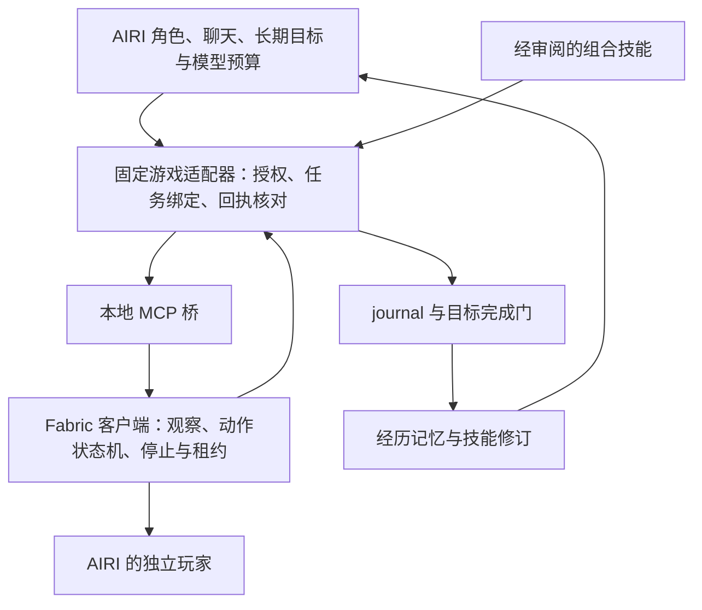

# Minecraft Fabric 实现方向与分批验证

日期：2026-09-09。状态：研究建议，待选型；未安装外部项目，未实现游戏接入。

本文件承接 [插件与 Minecraft 勘探](./extension-and-minecraft-exploration.md)。目标是让同一个 AIRI 以独立玩家身份陪玩，沿用现有目标、记忆、技能审批和证据机制。

## 推荐决策

优先评估“固定 AIRI 游戏适配器 + 本地 MCP 桥 + Fabric 客户端执行器”。MCPFabric 是桥接原型的首选候选，尚未选为正式依赖。游戏执行器需要补齐任务身份、取消确认、断线停止和完成判定。

Mindcraft 提供交互和动作组织参考。Voyager 提供技能积累参考。AIBot 提供目标后置条件参考。保留 AIRI 的模型调度、人格和记忆所有权，不整套移植这些项目的智能体循环。

首批固定 Windows、一个 Minecraft 版本、一个测试服务器和一个 AIRI 玩家。具体版本取用户模组需求与候选组件支持范围的交集，不追随最新版。客户端路线需要独立实例和适用的玩家身份；实际资源开销在原型中测量。

## 研究范围与证据限制

本轮阅读公开 README 和关键源码。Mindcraft 阅读 `stable` 分支，其余主要阅读 `main`。网页缓存时间不同，不能当作同一提交的完整审计。实施前必须固定 commit、许可证、构建产物摘要与游戏版本。

MCPFabric 的桥接、控制器、导航入口和客户端入口已读取。Voyager 的技能管理和评价器已读取。Mindcraft 的智能体入口和动作管理器已读取。AIBot 的 README 与目录已读取，但大型 `GoalExecutor.java` 页面未取得完整可读实现，因此其执行细节仍按文档声明处理。

Easy LLM、STEVE-1 属于路线对照。未进行这些项目的安装、编译、世界运行或效果复现。下面的验收项目全部是待执行计划。

## 六个项目的取舍

| 项目 | 可借鉴的部分 | 与本 fork 的差异 | 建议 |
| --- | --- | --- | --- |
| [Mindcraft](https://github.com/mindcraft-bots/mindcraft) | 聊天与行动协调、角色配置、动作中断、任务夹具 | 自带模型循环、历史、记忆和 Mineflayer 身体 | 阅读行为组织与场景，不引入第二套人格和调度器 |
| [Voyager](https://github.com/MineDojo/Voyager) | 技能描述检索、执行反馈、探索课程 | 生成代码依赖 Mineflayer；自动评价使用模型 | 借鉴技能成长流程，审批和完成门继续归 AIRI |
| [MCPFabric](https://github.com/Etoryx/mcpfabric) | 本地桥、结构化观察、客户端动作和导航 | 现有 RPC 不等于持久任务协议；同时提供管理能力 | 优先做桥接原型，补齐执行契约后再用于自主行动 |
| [AIBot](https://github.com/zoyluoblue/mc_aiplayer) | 确定性任务、目标条件、暂停恢复 | 服务端模拟玩家，自带规划和持久化 | 借鉴完成判定；自己的服务器需要 NPC 时再评估整合 |
| [Easy LLM](https://github.com/Koichiro-terao/Easy-LLM-Agent-in-Minecraft) | WebSocket 观察流和外部智能体样例 | Fabric 服务端模组与 Mineflayer 并用 | 作为混合路线参考，不作为替换 Mineflayer 的成品 |
| [STEVE-1](https://github.com/Shalev-Lifshitz/STEVE-1) | 文字指令到画面驱动的键鼠行为 | 需要独立模型运行环境，与 API 工具路线不同 | 留作视觉控制研究，不列为首批依赖 |

### 源码改变了哪些判断

MCPFabric 的 `nav.pathTo` 返回 `started: true`，随后通过 `nav.status` 读取导航状态。接收命令与到达目标是两个阶段。[NavHandlers.java](https://raw.githubusercontent.com/Etoryx/mcpfabric/main/src/client/java/dev/mcpfabric/client/handlers/NavHandlers.java)

它的 HTTP 客户端用 AbortController 终止请求等待。请求体是 `method/params`，没有本 fork 的任务归属字段。网络超时不能证明游戏动作取消，超时后重发也可能重复执行。[bridge.ts](https://raw.githubusercontent.com/Etoryx/mcpfabric/main/mcp-server/src/bridge.ts)

控制器持有全局移动、挖掘和导航状态。导航有截止时间，直接移动没有同样的租约。路径节点耗尽也能进入 `reached`，因此适配器仍需核对最终位置。当前读取的控制器中，没有可供 AIRI 使用的命令身份；其他文件是否提供完整断线清理仍需验证。[BotController.java](https://raw.githubusercontent.com/Etoryx/mcpfabric/main/src/client/java/dev/mcpfabric/client/BotController.java)

Mindcraft 的动作管理器区分成功返回、中断和超时。调用方必须联合理解这些字段，不能只读取 `success`。我们采用明确的终态和后置条件，避免包装时丢失含义。[action_manager.js](https://raw.githubusercontent.com/mindcraft-bots/mindcraft/stable/src/agent/action_manager.js)

Voyager 通过技能描述检索代码；其自动评价器将观察交给模型判断成功。我们可以复用这种反馈流程，但可计算目标要先用确定性条件核对，模型评价只补充解释。[skill.py](https://raw.githubusercontent.com/MineDojo/Voyager/main/voyager/agents/skill.py)、[critic.py](https://raw.githubusercontent.com/MineDojo/Voyager/main/voyager/agents/critic.py)

## 建议架构

这是本 fork 的建议，不是上游作者已确认的设计。

### 所有权

| 所有者 | 持有内容 | 对外行为 |
| --- | --- | --- |
| AIRI 核心 | 目标、预算、授权、计划版本、经历和审批 | 发起有界工作，决定继续、阻塞和完成 |
| 固定游戏适配器 | 连接绑定、任务与命令映射、回执核对 | 暴露少量领域工具，记录实际来源 |
| Fabric 执行器 | 当前动作、输入键、路径、游戏快照、租约 | 每 tick 执行动作，遇到停止条件立即清理 |
| 插件界面 | 连接状态、活动任务、停止入口 | 显示核心投影，不创建另一份任务状态 |
| 组合技能 | 有界步骤、前置条件、依赖能力版本 | 只能通过适配器使用获准的游戏能力 |

Electron 内部沿用现有 Eventa 契约。外部 Java 边界沿用候选项目协议并增加版本化领域契约，不要求 Java 实现 Eventa。首批优先复用现有 MCP 接线；插件承担生命周期与展示，不再重复注册同一组工具。

现有 [MCP store](../../apps/stage-tamagotchi/src/renderer/stores/tools/mcp.ts) 已提供发现与调用。[插件 store](../../apps/stage-tamagotchi/src/renderer/stores/tools/plugins.ts) 是另一条注册路径。实施时只选择一个工具所有者，原始管理工具不得同时暴露给模型绕过适配器。

现有 [AiriBridge](../../integrations/minecraft/src/airi/airi-bridge.ts) 保留上游消息边界作为参考。第一批不同时建立 MCP 和 `spark:command` 两条动作入口，避免重复调度。后续若需 server-sdk 通道，统一映射到同一个执行所有者。

### 第一个工具面

建议从六个领域操作开始，名字与参数尚未成为公开 API：

- `observe`：读取本玩家状态、背包与有限范围观察，返回采集时间和观察范围。
- `move_to`：到达短距离目标，带距离、时间和行为限制。
- `collect`：采集指定物品，限制数量、区域和执行时间。
- `status`：按命令身份查询，不只返回全局最后一次状态。
- `cancel`：按命令身份取消，等待游戏侧停止确认。
- `say`：在游戏聊天发言，沿用来源会话并防止自身消息回流。

先实现 `observe/move_to/status/cancel`。`collect/say` 留到后续批次。上述是领域设计，不表示 MCPFabric 已完整提供同名能力。首批不把所有底层工具塞入每次模型请求。

### 必须先明确的执行契约

请求由宿主绑定 AIRI 的 `sessionId/taskId/runId` 和计划版本，模型不能自行指定其他会话。游戏绑定另含玩家 UUID、连接代次、维度和世界标识。服务器地址不能单独作为世界身份；无法取得稳定身份时，仅使用当前连接作用域并禁止跨连接自动恢复。

每个动作还包含命令 ID、参数摘要和截止时间。执行器按连接代次与命令 ID 去重；相同 ID、不同参数必须拒绝。重复请求只返回已有状态，不再次移动或采集。

状态建议为 `accepted → running → succeeded/failed/cancelled/expired`。`cancel_requested` 仅表示取消请求已送达。丢失终态回执时，核心记为待核对，不能推断成功或停止。

终态回执包含命令身份、最终快照、结束原因和后置条件结果。移动核对距离；物品任务区分“最终持有数量”与“本次新采集数量”。后者需要采集事件和前后数量，不能把别人丢给她的物品默认为自己采集。

执行器负责租约和本地停止。适配器退出、租约失效、退出世界、死亡、切换维度或身份变化时，停止输入、挖掘和导航，并让旧命令失效。网络恢复后先核对现状，再由核心决定是否启动新命令。

取消不等待模型返回，也不排在长动作后面。每个玩家同一时间只有一个写动作所有者。用户停止优先于普通任务；本地避险可打断动作，但不能自行另开无限 LLM 循环。

### 证据与记忆

[chat.ts](../../packages/stage-ui/src/stores/chat.ts) 当前把 `mcp_` 工具归为 `remote_agent`。MCP 报告不能直接作为变更证明。插件改名后落入默认 `builtin` 同样不能解决这个问题。

需要由核心支持游戏领域的证据核对：先核对来源、授权、连接代次和命令身份，再读取新鲜状态并核对目标条件。journal 同时保留原始回执与核对结果。这里的可信范围是本地受控游戏实例，不能扩展成任意 MCP 服务的报告都可信。

技能源码获批不等于技能运行结果可信。组合技能调用产生的子命令必须继承任务身份；完成门依据子命令回执，不依据技能自己输出的成功文字。

游戏事件只在有意义的变化时进入上下文。移动进度合并，死亡、玩家指令和动作终态优先。预算耗尽时停止新的模型规划，已有有界动作仍服从截止时间和用户取消。

记忆区分当前观察、历史经历和可复用技能。坐标绑定世界和维度；跨世界检索只能作为历史背景。游戏聊天、告示牌和书本保留外部内容来源，不转成宿主授权。

## 自开发能力如何接入

当前 [executeSkill](../../packages/stage-ui/src/stores/skills.ts) 核对源码后调用沙箱，并传入 coding bridge。这证明技能执行边界存在，不证明它已经可以调用任意游戏工具。

现有 [createCodeModeRuntime](../../packages/coding-harness/src/ptc/code-mode.ts) 已接收具名工具集合，并限制桥接次数、运行时间和内存。后续优先复用这一执行边界。新增的是游戏工具绑定、任务继承和取消传播，不另建一个通用脚本引擎。

因此分两步推进。第一步由 AIRI 生成有界步骤数据，固定执行器校验操作集合、循环上限和任务绑定。第二步再为沙箱提供受限游戏能力桥，执行时核对当前授权与能力版本。

首个技能建议是“出门前准备”：观察物品 → 检查缺口 → 请求获准的补给操作 → 再次观察。测试中验证缺材料、取消和版本变化。缺少底层能力时记录技能阻塞，不让生成代码绕到任意网络或宿主入口。

审核绑定技能内容、依赖能力与测试证据。修改后重新审核。Java 模组更新仍由开发流程构建、隔离验证和发布，首批不允许 AIRI 自行热替换正在控制玩家的模组。

## 候选组件的实施前选择

| 决策 | 首选候选 | 备选 | 决策条件 |
| --- | --- | --- | --- |
| 桥接基础 | 适配或维护小范围 MCPFabric fork | 参考其实现编写最小专用 Fabric 桥 | 固定版本可构建；所需客户端能力可用；补契约的改动可维护 |
| 寻路 | 原型先评估 MCPFabric 自带 A* | [Baritone](https://github.com/cabaletta/baritone) | 同一地形比较到达、取消、卡住恢复和资源占用 |
| 玩家形态 | 独立 Fabric 客户端 | AIBot 式服务端模拟玩家 | 是否要真实客户端体验；是否控制服务器；机器资源是否足够 |

Baritone 提供 Fabric 构建和寻路 API，可作为复杂导航候选。它不是 LLM 调度器。其 LGPL-3.0 与主要候选的 MIT 不同，采用时需单独确认分发方式。此处只记录选项，不新增依赖。

采用组件前由用户参与选择。无需先决定插件市场、跨平台宿主或多个 Minecraft 版本。若原型需要大面积重写 MCPFabric，转为最小专用桥；上层领域契约保持不变。

## 批次与原计划映射

沿用原 MC-0、MC-1 编号。MC-0 拆成三个可独立核对的子批，不把研究完成登记为实现完成。

| 批次 | 交付 | 关联原批次 | 进入下一批的条件 |
| --- | --- | --- | --- |
| MC-0a | 固定候选提交和版本；隔离客户端；只读连接 | 原 MC-0，EP-0 | 位置、背包、玩家与世界绑定正确；连接错误可解释 |
| MC-0b | 有界移动、命令身份、租约、取消、断线停止 | 原 MC-0，EP-0 | 下列执行契约场景通过；失败保留实测结果 |
| MC-0c | AIRI 领域工具、来源、journal、完成门接线 | 原 MC-0，EP-1 的固定适配器边界 | 真聊天可下令；跨窗口不重复执行；回执丢失不伪造完成 |
| MC-1a | 跟随、少量采集、补给与聊天 | 原 MC-1，[LG](./long-horizon-goals-plan.md)、[PC](./persona-continuity-plan.md) | 受控世界与普通地形均有结果记录；新指令可打断 |
| MC-1b | 世界作用域记忆、事件压缩、预算约束 | 原 MC-1，[MQ](./memory-quality-plan.md)、[SP](./social-presence-plan.md) | 旧坐标不当作当前事实；无变化不重复调用模型 |
| MC-1c | 一个经审阅的组合技能及修订流程 | 原 MC-1，[SG](./skill-growth-plan.md)、EP-1 | 成功、缺条件、取消、撤销、内容变更均可核对 |

MC-0a 可先独立推进。EP-0 的来源与授权契约是自主行动前置。完整 EP-2 插件包平台不是 Minecraft 首批的前置。持久化与恢复继续关联 [MD](./maintainability-and-data-plan.md)，可靠性继续关联 [DR](./daily-reliability-plan.md)。

## 首批验收场景

先用确定性协议调用验证执行器，再走 AIRI 聊天。以下阈值是建议验收标准，不是已测性能。

| 场景 | 操作或提问 | 期望结果与证据 |
| --- | --- | --- |
| 身份与观察 | “你在哪里？背包里有什么？” | 与游戏画面及结构化快照一致，附玩家、维度和采集时间 |
| 正常移动 | “走到前方指定标记处。” | 先报告正在行动，距离符合预设容差后才报告到达 |
| 中途取消 | 移动中说“停下。”，再测试本地停止按钮 | 不再启动后续动作；执行器收到取消后两个游戏 tick 内清除控制意图；另测端到端耗时 |
| 桥接退出 | 移动中结束专用桥进程 | 租约失效后两个游戏 tick 内清理控制；不依赖 AIRI 再次发停止请求 |
| 回执丢失 | 丢弃终态响应，再以相同 ID 请求 | 不重复执行；可查询原状态，未知则明确待核对 |
| 旧世界命令 | 切换世界后送达旧命令 | 因连接代次或世界绑定不符而拒绝，新世界角色不动 |
| 多窗口 | 两个 renderer 观察同一任务并刷新 | 只产生一次命令；任务结果回到来源会话 |
| 不可到达 | 指定封闭目标 | 有界失败，报告原因与最终位置，不把路径耗尽当到达 |
| 数量条件 | “本次采集 4 个原木。” | 用本次采集事件核对；已有库存和别人赠送的物品不冒充采集 |
| 模型预算耗尽 | 动作中停止模型调用额度 | 无新增规划；动作到期或取消仍能停止；不自动开启旁路模型 |
| 记忆隔离 | 在另一个世界问“之前的箱子在哪？” | 标注历史世界，不能自动前往当前世界同坐标 |
| 技能撤销 | 技能运行时撤销批准，再次调用 | 停止后续子命令并取消在途动作；新调用被拒，原始证据保留 |

日志记录提交、构建摘要、游戏版本、模组列表、世界夹具、实际模型、输入与回执。停止测试同时记录控制意图和实际位移；惯性、落下等物理运动不能与仍按住移动键混淆。

记录 PASS、FAIL、BLOCKED、NOT-RUN 和证明范围。先完成固定夹具的取消与隔离，再扩展普通地形。后续使用至少三个固定种子重复采集与导航，报告逐次结果，不用一个演示推断通用生存能力。

## 本轮交付与检查

本轮只新增研究方案并更新文档索引。外部依赖、Java 工程、插件运行态与主实例均未改变。工作区原有改动保持原样。

检查：文档相对链接有效，`git diff --check -- docs/fork/MODS.md` 通过。`corepack pnpm lint` 退出码 0，保留工作区警告。

根目录没有 `type-check` 脚本，`corepack pnpm type-check` 返回命令不存在。随后按根 `typecheck` 的相同筛选范围串行执行：`corepack pnpm -r --workspace-concurrency=1 -F "./packages/*" -F "./apps/*" -F "./server/**" -F "./docs" run typecheck`。范围为 56 个工作区项目，退出码 0。

上述是当前工作区静态检查，不是外部项目构建或游戏运行验收。游戏运行验收未开始。
